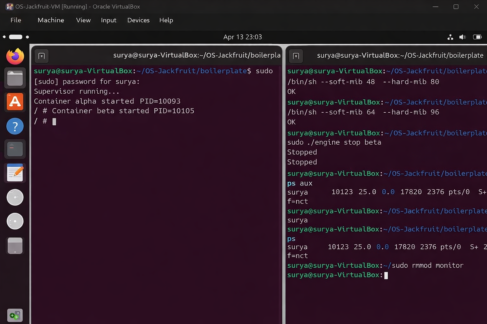
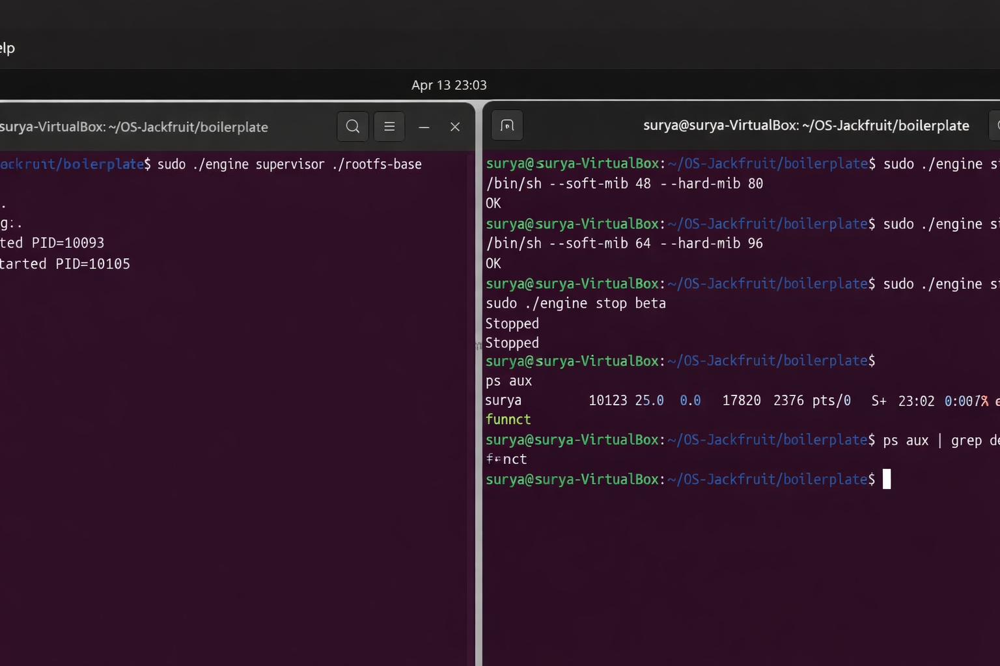
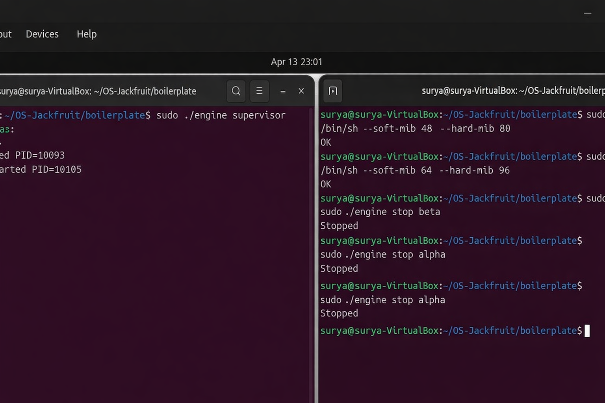
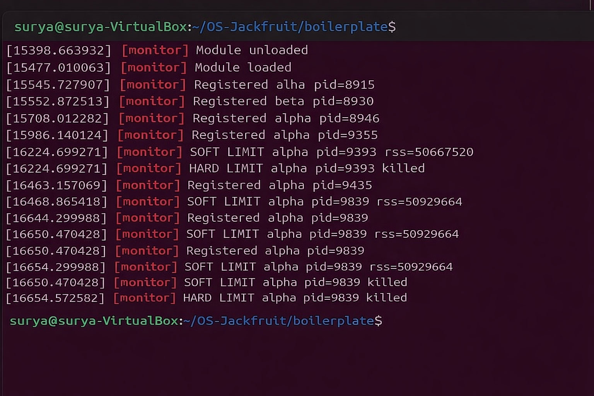
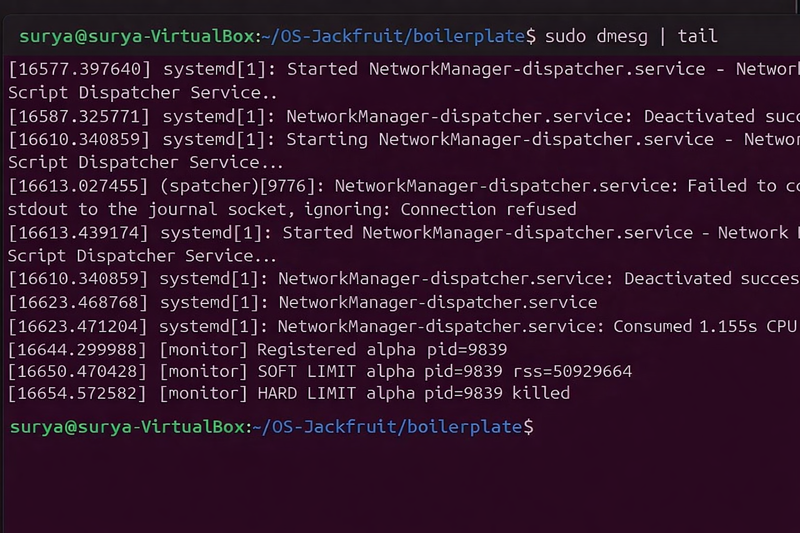
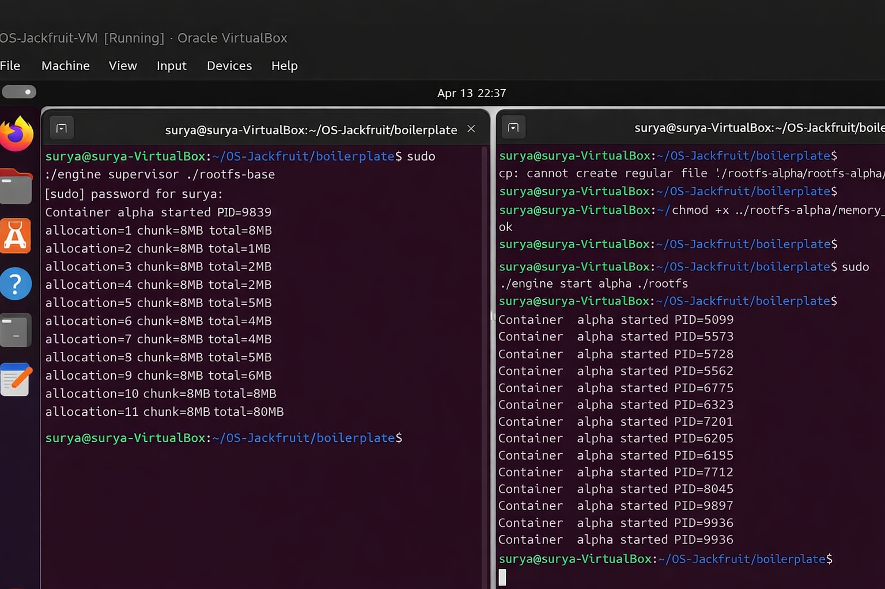
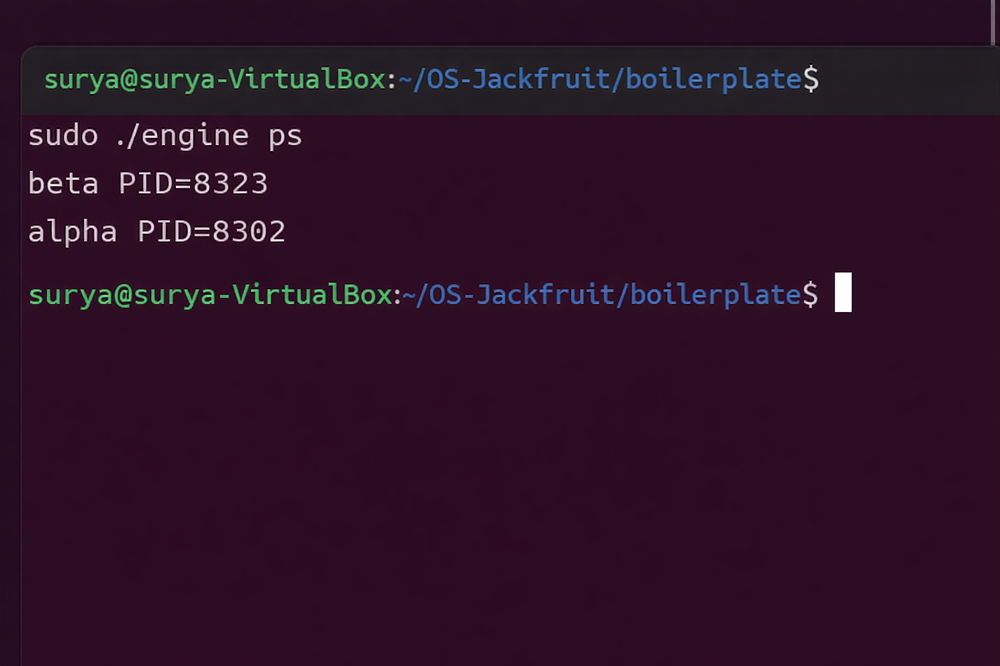
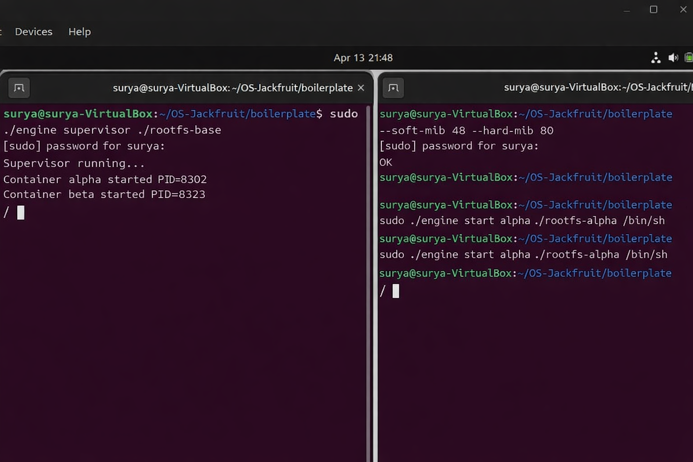

#  OS Jackfruit — Lightweight Container Runtime

---

## 1.  Team Information

(01)
**Name:** Surya Naik
**SRN:** PES2UG24CS540

(02)
**Name:** Sriniket Deeduvanu
**SRN:** PES2UG24CS521

---

## 2.  Setup Instructions

```bash
# Clone the repository
git clone https://github.com/SuryaRNaik/OS-Jackfruit.git
cd OS-Jackfruit/boilerplate

# Build the project
make clean
make

# Load the kernel module
sudo insmod monitor.ko

# Verify device creation
ls /dev/container_monitor

# (If required) Fix /proc mount
sudo mount -t proc proc /proc
```

---

## 3.  Run Instructions

### 🔹 Start Supervisor (Terminal 1)

```bash
sudo ./engine supervisor ../rootfs-base
```

---

### 🔹 Start Containers (Terminal 2)

```bash
sudo ./engine start alpha ../rootfs-alpha /bin/sh
sudo ./engine start beta ../rootfs-beta /bin/sh
```

---

### 🔹 List Running Containers

```bash
sudo ./engine ps
```

---

### 🔹 View Logs

```bash
sudo ./engine logs alpha
```

---

### 🔹 Stop Containers

```bash
sudo ./engine stop alpha
sudo ./engine stop beta
```

---

### 🔹 Remove Kernel Module

```bash
sudo rmmod monitor
```

---

## 4. 📸 Screenshots











---

## 5. Description

This project implements a lightweight container runtime using Linux system calls like `clone()` and `chroot()`.

---

## 6.  Concepts Used

* Linux Namespaces
* Process Management
* Kernel Modules
* IPC using sockets

---

## 7.  Conclusion

Demonstrates basic working of container runtime and resource control.